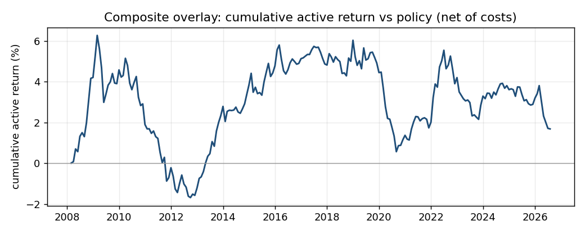
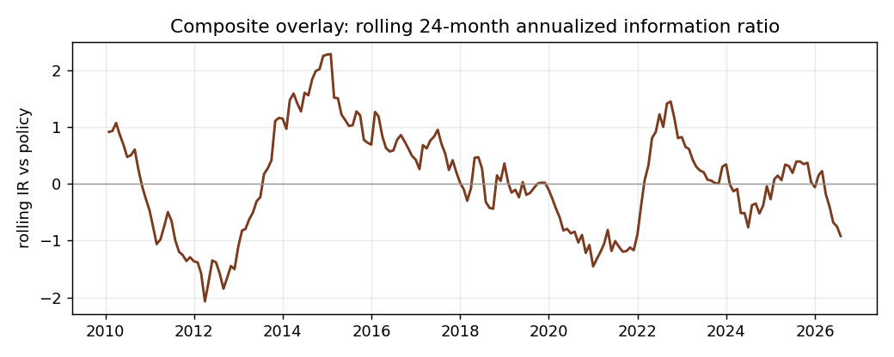

# Tactical Overlay on a Multi-Asset Policy Portfolio — Research Note

*Data vintage 2026-07-05 (ETF total returns + FRED yields + yfinance dividends),
frozen as a snapshot for reproducibility. Regenerate with
`python scripts/run_backtest.py --snapshot-load data/snapshot_2026-07` (or `--real`
to pull live). All figures are net of costs and after turnover limits unless stated.*

*Revision note: an earlier draft of this note was computed on a snapshot whose sleeve
labels were scrambled by a loader bug (yfinance returns columns in alphabetical ticker
order; the loader assigned sleeve names positionally, so "EQ_US" held T-bills and
"CASH" held VTI). Every number below is from the corrected data; the bug, its
detection, and its fix are disclosed in Section 5.*

## 1. Question and thesis
Can a disciplined tactical overlay, driven by pre-committed, economically motivated
signals, add information *over* a fixed strategic policy portfolio net of realistic
costs? The prior is modest: cross-asset momentum, value, carry, and a macro nowcast
are documented, but on a short single-cycle ETF sample they should produce a small,
regime-dependent edge hard to distinguish from zero. That is what the evidence shows.

## 2. Setup
- **Universe / proxies (monthly total return):** EQ_US=VTI, EQ_INTL=VEA, GOVT=IEF,
  CREDIT=HYG, TIPS=TIP, CMDTY=DBC, CASH=BIL. Sample **2007-01 to 2026-07, 235 months**;
  overlay trades after a 12-month warmup (~2008–2026).
- **Strategic policy (the benchmark):** EQ_US 35, EQ_INTL 15, GOVT 20, CREDIT 10,
  TIPS 5, CMDTY 5, CASH 10 (%). Judged on information ratio *over policy*, run through
  the identical loop and cost model — not total return.
- **Signals (committed before testing, four documented families):** *momentum* = 12m
  trailing return (Moskowitz-Ooi-Pedersen 2012); *value* = negative 5y return, 12m skip
  (long-horizon reversal, Asness-Moskowitz-Pedersen 2013); *carry* = yield/carry level
  per sleeve — FRED yields (govt/TIPS/cash), Moody's Baa for credit, trailing dividend
  yield for equities, a roll-yield proxy for commodities; *macro nowcast* = trailing
  change in the curve slope and Baa credit spread mapped to a fixed, pre-committed
  risk-on/off asset-response vector. *composite* = equal-weight z-blend (no weight tuning).
- **Construction:** bounded tilt around policy, ±10% per-sleeve cap (the funding
  sleeve included), CASH funding sleeve, monthly rebalance. **Turnover limits:** 0.20
  one-way monthly cap + 0.02 no-trade band, applied to the strategy and the policy
  benchmark alike so neither leg is forced to churn frictions the other may skip.
  **Costs:** 10 bps one-way headline, on a 0/5/10/15 grid. Point-in-time throughout;
  a no-look-ahead test poisons all future prices/carry/macro.

## 3. Results (composite overlay, net of costs)
- **Headline: IR vs policy 0.07, tracking error 1.6%/yr.** CAGR 6.75% vs policy 6.59%;
  vol 9.15% vs 9.61%. A small add, and (Section 4) not separable from zero. (Making
  the turnover governors symmetric — the policy benchmark also skips sub-band drift
  corrections — trimmed the IR from 0.08; part of the apparent edge had been the
  benchmark's extra churn.)
- **By signal (IR vs policy):** macro **+0.22**, momentum **+0.18**, composite +0.07,
  carry +0.02, value **−0.52**. The macro nowcast and momentum are the positive
  families; carry is roughly flat; value (long-horizon reversal) actively hurt in this
  momentum-led sample — buying what had fallen over five years was persistently wrong
  here. The equal-weight composite averages the winners and the one big loser down
  toward zero: the price of refusing to pick the blend after seeing the results.

  The curve earns most of its keep early (defensive tilts through the GFC, peaking near
  +6% by 2009), gives it back by 2012, rebuilds through 2014–2019, is hit hard by the
  2020 rebound it stayed defensive through, and ends around **+2% cumulative over ~18
  years** — real but tiny.
- **Cost sensitivity (composite IR):** 0.12 / 0.09 / 0.07 / 0.04 at 0 / 5 / 10 / 15
  bps — the edge shrinks steadily with costs.
- **Per-sleeve vs flat costs:** under a per-sleeve schedule (HY 15, commodities 12,
  Treasuries/cash 1–3 bps) the IR is **0.08** vs 0.07 at a flat 10 bps — the flat
  assumption is conservative, because the overlay's turnover sits mostly in
  cheap-to-trade sleeves.
- **Turnover cap and rebalance frequency (a genuine finding):** tighter turnover caps
  *raise* IR (uncapped 0.01 → 0.20-cap 0.07 → 0.10-cap 0.11), and **quarterly
  rebalancing lifts IR to 0.09 while nearly halving turnover** (0.52 vs 0.95/yr). Much
  of the monthly turnover is uncompensated churn; trading less is the single most
  reliable improvement here.
- **Regime table (composite IR vs policy):** GFC **+0.68** and inflation 2021–22
  **+0.83** are the two real positives; COVID-2020 **−2.01** (the overlay stayed
  defensive straight through the v-shaped rebound); the QE decade ~0 (+0.07); 2023–2026
  −0.63. The edge lives in drawn-out stress regimes and pays for it in sharp recoveries.

## 4. Robustness (the actual result)
- **Bootstrap 95% CI on the composite IR: [−0.46, +0.60]**, point 0.07. **Zero is
  central.** With ~215 monthly active observations, this is the honest verdict.
- **Deflated Sharpe = 0.18** (and the true trial count is higher once the config search
  — caps, frequency, cost schedule, vol scaling, lookbacks — is counted): we cannot
  reject "no edge."
- **Random-tilt null:** a turnover-matched random overlay beats the composite only
  **3.5%** of the time (random-tilt mean IR −0.29). The overlay is clearly better than
  arbitrary tilting; that is a low bar, but it clears it.

  The rolling IR swings from about −2.1 to +2.3 and crosses zero repeatedly — there is
  no stable edge, only regimes.
- **Vol-scaled tilts** (risk-equalized instead of weight-equalized) IR **0.00** vs
  plain 0.07: an available construction that did not help here, shown so the choice is
  explicit.
- **Simple tilt vs Black-Litterman:** BL IR **+0.01** vs simple tilt +0.07 — BL
  translates views into constrained weights (the job) but adds estimation error, not
  alpha, out of the box.
- **Walk-forward (momentum lookback family):** best in-sample IR 0.39, OOS 0.41. The
  OOS number *exceeding* the in-sample best is itself a warning about how few OOS
  blocks a 235-month sample yields — treat it as noise, not skill. **White's Reality
  Check p-value for the best lookback (7 tried) is 0.18**, so the momentum-family
  result is explainable by the search.

## 5. Honest limitations
- **Sample:** ~19 years, one credit cycle (GFC, QE decade, 2020, 2022). Too short and
  peculiar for strong claims; a 0.07 IR is noise here.
- **Four artifacts caught and disclosed.** (a) An earlier cut showed carry IR +0.57
  until traced to FRED restricting the ICE BofA HY series to a rolling ~3-year window;
  credit now uses Moody's **Baa** (investment grade — a documented mismatch for the HY
  sleeve). (b) A NaN-score weight bug was silently dropping sleeves with no early
  history and over-trading; fixed so a "no view" sleeve stays at policy weight.
  (c) **The first full real-data draft of this note was computed on a scrambled
  universe:** the ETF loader assigned sleeve names to yfinance columns positionally,
  but yfinance returns columns in alphabetical ticker order — so "EQ_US" held BIL and
  "CASH" held VTI, and every prior headline number was wrong. Caught by a
  vol/inception-date sanity check on the snapshot; fixed by renaming columns by ticker
  with a regression test that shuffles column order. (d) A one-month look-ahead at
  walk-forward selection boundaries (the boundary rebalance was placed one month before
  the training window closed); fixed and pinned by a test. Each of these would have
  silently flattered or distorted the result. Finding them is what the test-and-snapshot
  discipline is for; disclosing them is the point of the note.
- **Proxies:** commodity carry is a two-basket roll proxy; equity carry is dividend, not
  earnings, yield; macro uses FRED release timing, not true ALFRED vintages.
- **What would change my mind:** a longer spliced sample where the composite CI clears
  zero out of sample, HY-specific full-history carry, and the momentum knife-edge
  resolving into a plateau. Absent that, this is a methods showcase.

## 6. Current positioning read (as of 2026-07-31)
The composite leans **defensive**. Active tilts vs policy: **GOVT +8.0%, CREDIT +2.8%,
TIPS +0.1%, CASH 0%, EQ_INTL −0.6%, CMDTY −1.6%, EQ_US −8.7%.** The driver is a
risk-off macro nowcast (flattening curve / widening Baa spread → duration and credit,
away from equity) reinforced by carry favoring bond yields over the US equity dividend
yield, with momentum softening but not reversing the equity underweight. In plain
terms: overweight duration and credit, funded by underweighting US equities.

**Confidence: low, and sized accordingly.** The composite IR is ~0.07 with a confidence
interval straddling zero and a deflated Sharpe of 0.18, so this is a *small lean*, not a
call — which is why the ±10% cap and the (net-additive) turnover limit exist, and why
the most defensible configuration found is the lowest-turnover one (quarterly, tightly
capped). The honest summary: *a disciplined multi-signal overlay on this sample produces
a modest, regime-dependent tilt whose edge cannot be distinguished from zero, so the
right size is small and the right posture is humility.* Four data/code artifacts that
would have flattered or distorted the result were caught and corrected in the process —
which is the actual deliverable, not a Sharpe ratio.
